# ReflectivityAndTransmittance

# Оглавление
[Введение	3](#_toc186108931)

[Отражательная и пропускательная способность	4](#_toc186108932)

[Отражательная способность диэлектрических пленок в условиях полного внутреннего отражения	12](#_toc186108933)

[Построение графика зависимости отражательной способности диэлектрических пленок от углов падения ТЕ- поляризованной плоской волны.	15](#_toc186108934)

[Сдвиг Гуса-Хеихена	17](#_toc186108935)

[Применения	19](#_toc186108936)

[Заключение	22](#_toc186108937)

[Список литературы	23](#_toc186108938)

#

# **Введение**
В данной курсовой работе рассматривается актуальная проблема исследования взаимодействия электромагнитных волн с тонкими диэлектрическими пленками в условиях полного внутреннего отражения (ПВО). Изучение отражательной (R) и пропускательной (T) способностей таких структур имеет значительное значение для развития различных областей современной оптики и фотоники. 

Широкое применение тонкопленочных покрытий в сенсорах, оптических фильтрах, интегральной оптике и других устройствах обуславливает необходимость глубокого понимания закономерностей их взаимодействия со светом. В частности, способность тонких пленок изменять характеристики отражения и пропускания в зависимости от длины волны падающего излучения, толщины пленки и ее показателя преломления, открывает широкие возможности для создания новых функциональных оптических элементов. 

` `Целью данной работы является исследование зависимости коэффициентов отражения и пропускания (R и T) от длины волны ТЕ-поляризованной электромагнитной волны при полном внутреннем отражении на границе раздела «подложка-пленка». 

Для достижения этой цели будут решены следующие задачи:  

1\. Подробное теоретическое описание взаимодействия ТЕ-поляризованной волны с тонкой диэлектрической пленкой на границе раздела двух сред в условиях ПВО, включая вывод формул для расчета R и T.  

2\. Анализ полученных результатов, выявление резонансных явлений и объяснение наблюдаемых закономерностей. 

3\. Обсуждение возможностей применения полученных результатов для разработки новых оптических устройств.   

# **Отражательная и пропускательная способность**
Отражательная способность (R) — величина, описывающая способность какой-либо поверхности или границы раздела двух сред отражать падающий на неё поток электромагнитного излучения. Широко используется в оптике, количественно характеризуется коэффициентом отражения. Для характеризации диффузного отражения солнечного излучения используется величина, называемая альбедо.

Способность материалов отражать излучение зависит от угла падения, от поляризации падающего излучения, а также его спектра. Зависимость отражательной способности поверхности тела от длины волны света в области видимого света глаз человека воспринимает как цвет тела.

Зависимость отражательной способности материалов от длины волны имеет важное значение при построении оптических систем. Для получения нужных свойств материалов по отражению и пропусканию света иногда используют просветление оптики как, например, при производстве диэлектрических зеркал или интерференционных фильтров.

Пропускательная же способность (T) есть величина, описывающая способность какой-либо среды или границы раздела двух диэлектрических сред пропускать падающий на неё поток электромагнитного излучения.

Хочется сразу отметить что в условиях ПВО, когда свет переходит из среды с большим показателем преломления в среду с меньшим показателем преломления под углом, превышающим критический угол, происходит полное отражение света от границы раздела. Для ТЕ-поляризации (электрическое поле перпендикулярно плоскости падения), амплитуда отраженной волны равна амплитуде падающей волны, и, следовательно, амплитуда прошедшей волны равна нулю. Это означает, что пропускание света отсутствует.

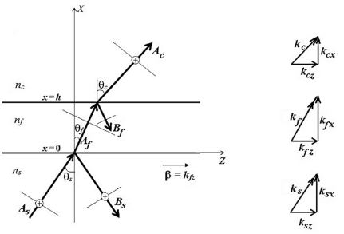     			

Будем полагать, что пленка находится на подложке с показателем преломления ns​ и покрыта защитным слоем с показателем преломления nc​. Здесь As​, Bs​ и Ac​ – амплитуды напряженности электрического поля падающей, отраженной и прошедшей волны, распространяющихся с волновыми векторами ks​, kf​ и kc​ соответственно. Углы наклона волновых векторов относительно нормали X показаны на рисунке. Вектор напряженности электрического поля Ey​ параллелен границам раздела диэлектрических слоев s−f и f−c.

Значения и направления распространения модулей волновых векторов поперечных ( ksx, kfx, kcx ) и продольных ( ksz, kfz, kcz ) плоских волн в каждом из слоев отмечены в соответствующих им прямоугольных треугольниках:

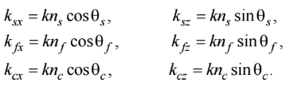

(1)

Модули продольных волновых компонент поля на границах s−f и f−c равны между собой, что легко доказывается с помощью закона Снеллиуса. Их записывают в виде равенства:

`        `ksz= kfz=kcz= β         	       (2)

где β является постоянной распространения.

Амплитуды отраженной Bs и прошедшей Ac волны в пленке являются комплексными величинами. Это объясняется тем, что ее толщина (h∼λ) намного меньше размера распространяющегося плоского волнового фронта. При прохождении через пленку плоская волна испытывает многократное отражение и преломление на границах s−f и f−c, а амплитуды отраженной Bs​ и прошедшей Ac​ волны являются результатом алгебраического сложения (соответственно в подложке и защитном слое) многих вторичных плоских волн со своими амплитудами и фазовыми задержками. В силу этого комплексной величиной будет коэффициент отражения (rТЕ) пленки, определяемый отношениями амплитуд.

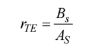       

`                                                                                   					`(3)                                            

Найдем его значение, определив вначале электрические поля в подложке, пленке и защитном слое.

Из рис. 1 следует, что такие поля, зависящие от переменных x и z, можно найти исходя из выражений:

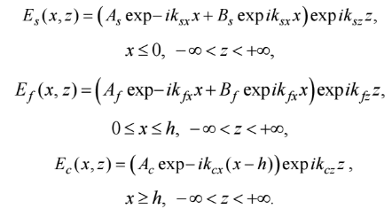                                                                                                                                                                                                                                                                 

(4)

(5)

(6)

Можно видеть, что поле (4) формируется в результате сложения в подложке двух наклонных (падающей и отраженной) плоских волн с амплитудами As​ и Bs​, поле (5) – в результате сложения в пленке двух встречных наклонных плоских волн с амплитудами Af​ и Bf​, а поле (6) – в результате прохождения в защитном слое наклонной плоской волны с амплитудой Ac​. С учетом (2) волновые компоненты продольных волн во всех слоях можно заменить на постоянную распространения β. Поперечные составляющие этих полей, зависящие только от переменной x, в каждом из слоев выделены круглыми скобками. С их помощью можно рассчитать амплитуды поперечных электрических полей при всех соответствующих им значениях x.

Описание электрических полей будем проводить с помощью функций U(x) и V(x) = iU′(x). В этом случае можно вычислять не только амплитуды таких полей, но и скорости их изменения в каждой из точек х. Выполнив такой переход, получим что

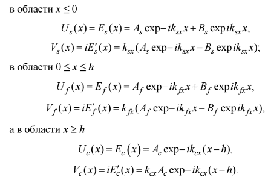

(7)

(8)

(9)            

Однако использование этих выражений затруднено тем, что амплитуды плоских волн, участвующих в формировании полей (7) – (9), являются неизвестными. Исключение составляет только амплитуда падающей волны AS, которая по условию решаемой задачи может быть произвольной и выбранной заранее. Поскольку амплитуды BS и AC​ являются искомыми, то исключению подлежат амплитуды Af​ и Bf плоских волн в самой пленке. С этой целью найдем параметры поперечных электрических полей (7) – (9) на границах s−f и f−c ее слоев. Так, из (7) и (8) следует, что при x = 0 амплитуды и скорости изменения таких полей на границе s−f будут равны:      

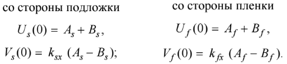     (10) 

Тогда непрерывность полей (7) и (8) на границе s − f будет выполняться при условиях:                                  

                                                                               (11)   

В свою очередь, из выражений (9) и (10) вытекает, что при x = h амплитуды и скорости изменения полей на границе f − c будут равны:

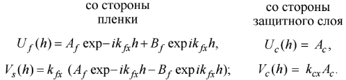

(12)

Как и ранее, условиями непрерывности на границе полей f −c будут равенства

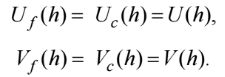

`                                     `(13)

Поскольку состояние электрического поля на границе s−f со стороны пленки определяется выражениями

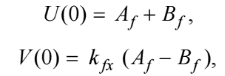                                

`                                  `(14) 

то амплитуду U(x) и скорость изменения поля V(x) поля при значениях 0≤x≤h можно находить из матричного уравнения

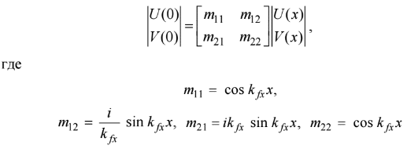

(15)

Элементы m11​, m12​, m21​, m22​ являются элементами характеристической матрицы пленки. Здесь в явном виде амплитуды плоских волн Af​ и Bf​ уже отсутствуют. Вместо них в (15) присутствуют граничные значения поля U(0) и V(0), показанные в (14). 

При x = h уравнение (15) с элементами характеристической матрицы 

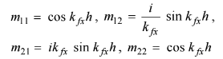

принимает вид

 

`                           `(16)

Матричное уравнение (16) становится уравнением связи состояний электрического поля пленки на ее границах s−f и f−c.

Примем теперь во внимание, что значения параметров электрического поля на границах s−f и f−c равны:

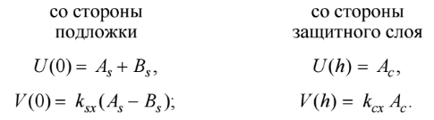

(17)

Это следует непосредственно из равенств (10) и (12). Подставляя теперь значения (17) в (16), получим матричное уравнение:

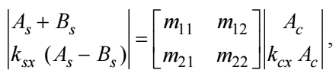

`                     `(18)

содержащее только амплитуды AS​, BS​ и AC​. Первая из них является амплитудой падающей волны, задаваемой заранее, а две остальные – амплитудами отраженной и прошедшей плоских волн, подлежащими определению. Такие амплитуды находятся из уравнений:

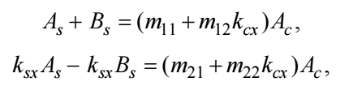

`             `(19)

получаемых из (18) путём выполнения операции матричного умножения.

Если левую и правую часть первого уравнения (19) умножить на −(m21+m22kCx)−(m21​+m22​kCx​), а левую и правую часть второго – на (m11+m12kCx)(m11​+m12​kCx​), то после сложения полученных результатов и преобразований получим равенство:

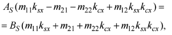

`            `(20)

в котором амплитуда Ас будет отсутствовать. 

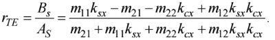Разделив правую и левую часть выражения (20) на AS​, после преобразований с учетом (3) получим:

(21)

Подставляя теперь в выражения (21) значения элементов характеристической матрицы пленки, получим:

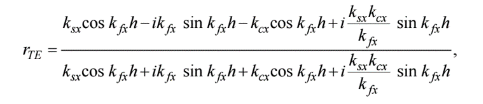

(22)

Поскольку выражение (24) содержит вещественные и мнимые компоненты, то уже на этой стадии можно отметить, что ожидаемые значения коэффициентов отражения пленки будут комплексными величинами.

Держа в голове следующие равенства

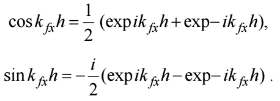

(23)

Получим следующее выражение:

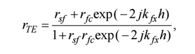

(24)

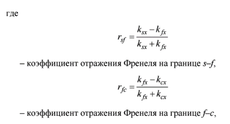

(25) 

(26)

# **Отражательная способность диэлектрических пленок в условиях полного внутреннего отражения**
Когда на границе s – f слоев соотношение показателей преломления будет nf < ns, а на границе f – c будет nf < nc. Соответствующая этому случаю схема прохождения в пленке плоских световых волн показана на рис.1 , где амплитуда падающей волны равна As, а амплитуды отражённой и прошедшей волны равны Bs и Ac соответственно. 

При углах падения θs< θs кр= arcsinnfns, где θs кр угол является критическим, никаких качественных изменений в отражающих свойствах пленки не возникает. С возрастанием угла падения угол преломления возрастает в большей степени. При определенном угле падения (θs) угол преломления луча достигает 90° (то есть преломленный луч движется параллельно границе сред). Этот угол называется критическим углом.

Поэтому значение коэффициента отражения пленки можно находить по формуле.	

`			`r= rsf+ rfc\* e-2ikfxh1+ rsf\* rfc\* e-2ikfxh              (1)

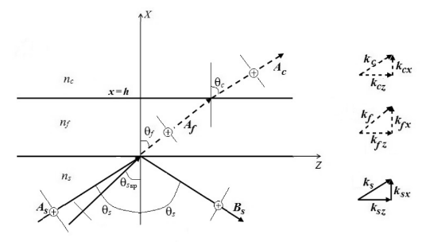

Рис. 2. Распространение ТЕ-поляризованной плоской световой волны в диэлектрической пленке при полном внутреннем отражении.

Существенные изменения в выражении (2) происходят при углах падения 

θs > θsкр, когда граница s – f находится в состоянии полного внутреннего отражения.

Согласно закону Снеллиуса:  sinθf = nsnf sinθs. Тогда

cosθf=  1-sinθf2 =1- ns2nf2 sinθs2

в состоянии полного внутреннего отражения, когда nssinθs> nf, принимает мнимые значения, равные ±i1nf(nssinθs)2- nf2 . Далее будем считать, что

cosθf= -i1nf(nssinθs)2- nf2 .				(2)

Мнимой окажется и поперечная волновая компонента kfx, которая с учетом (2) принимает значение

`			`kfx=knfcosθf= -ik(nssinθs)2- nf2		(3)

В следствии этого качественные изменения получают и коэффициенты Френеля rsf и rfc, входящие в (1):

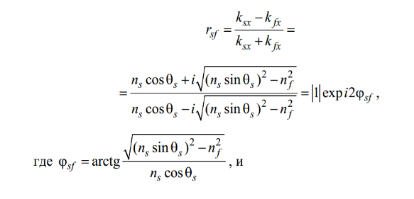

(4)

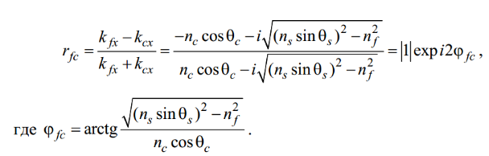

(5)

Кроме того, как следует из выражения (2) мнимое значение получает набег фазы поперечной плоской волны на толщине пленки:

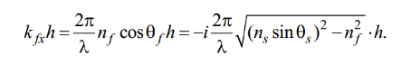

`			`(6)

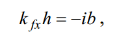Если принять

`									`(7)

то из (5) следует, что параметр

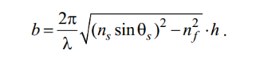

`						`(8)

Из (4) и (5) следует, что коэффициенты отражения на границе s – f и f – c слоев являются комплексными величинами с модулем, рав- ным единице. Это означает, что несмотря на якобы «полное» внутрен- нее отражение освещающей световой волны от границы s–f слоев, такая волна частично проникает в пленку, достигает границы f–c и отража- ется/преломляется от нее. Сказанное отмечено на рис. 1 пунктиром. Факт появления в тонкой пленке распространяющейся волны объясняется интересным явлением оптического туннелирования, а спо- соб «световой связи» границ s–f и f–c слоев принято называть туннельным. Суть явления оптического туннелирования состоит в том, что в присутствии на расстояниях, соизмеримых с рабочей длиной волны второй границы раздела диэлектрических слоев, условие полного внут- реннего отражения на первой из таких границ нарушается. Подставляя значения (4), (5) и (7) в (1), получим

`			`r= ei2φsf+ ei2φfc \* e-2b1+ ei2φsf\* ei2φfc \* e-2b					(9)

Таким образом, из (9) следует, что в условиях полного внутреннего отражения на нижней границе пленки вещественные компоненты коэффициента отражения (1) принимают комплексные значения, а его комплексная компонента (фазовая экспонента) – вещественное значение. В целом же коэффициенты отражения пленки, вычисляемые по формуле (9), являются комплексными величинами. В заключение отметим, что в на качественном уровне исследована зависимость отражательной способности пленки, работающей в режиме полного внутреннего отражения, от рабочей длины волны l. При этом отражательная способность находилась по формуле

R=|r|2= e2b+ e-2b+2cos(φsf- φfc)e2b+ e-2b+2cos(φsf+ φfc) *,*			(10)

где коэффициент отражения r представлен в виде (9). Ключевую роль в выражении (10) играет значение параметра b, обратно пропорционального длине волны l. Согласно (8) при коротких длинах волн параметр b принимает большие значения. В этом случае отражательная способность пленки R стремится к единице. Поэтому пленка, работающая в режиме полного внутреннего отражения, будет исполнять роль пропускающего фильтра длинноволнового излучения.

# **Построение графика зависимости отражательной способности диэлектрических пленок от углов падения ТЕ- поляризованной плоской волны.**

Для проверки полученных теоретических результатов было проведено экспериментальное исследование. В ходе эксперимента мы измерили отражательную способность тонкой пленки при различных углах падения TE-поляризованной волны и пронаблюдали возникновение полного внутреннего отражения. Целью этого этапа работы является визуализация теоретических результатов в виде графика зависимости отражательной способности от угла падения.

Параметры эксперимента:  

•   Длина волны света λ = 1 мкм 

•   Показатель преломления первой среды ns = 1.5 

•   Показатель преломления пленки nf = 1

•   Показатель преломления третьей среды nc = 1.8

•   Толщина пленки h = 2 мкм

•   0≤φ≤π2

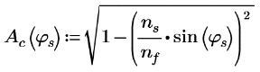

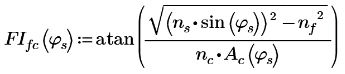

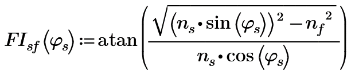

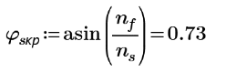

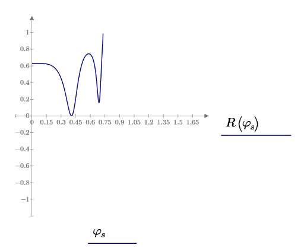

#

Рис.3 График отражательной способности R(φ) от угла падения φ
# **Сдвиг Гуса-Хеихена**
До сих пор мы представляли свет в волноводе в виде суммы плоских волн с учетом их фаз и направления нормалей к волновым поверхностям. Сейчас мы рассмотрим также энергию света и ее поток через волновод. Но прежде нам необходимо более точно определить, что мы понимаем под световым лучом Световой луч определяется здесь как направление вектора Пойнтинга или потока энергии света. В соответствии с этим под лучом понимается ось узкого пучка света или волнового пакета. Связь между нормалью к волновой поверхности и лучом по сути является пространственным аналогом соотношения между фазовой и групповой скоростями. Для простого случая плоской волны в однородной изотропной среде направления нормали к волновой поверхности и луча совпадают, но в анизотропной среде направление луча обычно отличается от направления нормали к волновой поверхности.

Сдвиг Гуса — Хенхена, который возникает при полном внутреннем отражении на границе раздела диэлектриков, представляет собой другой случай, когда поведение светового луча отличается от поведения нормали к волновой поверхности. При этом явлении отраженный луч (В) сдвигается в пространстве относительно падающего луча или волнового пакета (А), как показано на рис. 3 Такой пространственный сдвиг луча весьма важен для понимания поведения потока энергии в диэлектрических волноводах с позиций геометрической оптики.

Чтобы определить поперечный сдвиг луча, обозначенный на рис. 3 как 2zs , рассмотрим простой волновой пакет, состоящий из двух плоских волн, падающих под двумя незначительно отличающимися углами. Если z - составляющие соответствующих волновых векторов равны β±∆β, то комплексная амплитуда А(z) падающего волнового пакета на границе раздела х = 0 запишется в виде

A=ei∆βz+ e-i∆βz\* e-iβz= 2cos∆βz\*e-iβz 			(1)

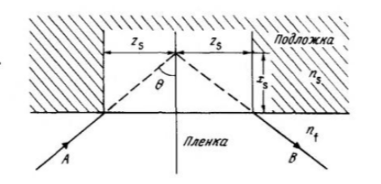

Рис. 3. Ход светового луча при полном внутреннем отражении на гра¬ нице раздела двух диэлектрических сред с учетом пространственного сдвига отраженного луча (сдвиг Гуса —Хенхеиа)

Прежде чем применить к каждой плоской волне законы отражения следует вспомнить, что фазовый сдвиг φ , появляющийся при полном внутреннем отражении, есть функция угла Ѳ (и постоянной β). При малых значениях ∆φ и ∆β можно воспользоваться следующим разложением

φβ+∆β=φβ+ dφdβ∆β					(2)

Учитывая это, амплитуду В(z) отраженного волнового пакета на границе х = 0 можно записать в виде

B=ei∆βz-2∆φ+ e-i∆βz-2∆φ\* e-iβz-2φ=

` `cos∆βz-2zs\*e-iβz-2φ ,   							(3)

где		

` `zs= dφdβ						(4)

Это дает нам пространственный сдвиг волнового пакета, т е луча, в компактном и простом виде. 

Во многих случаях удобно использовать понятие «эффективный волноводный показатель преломления», который определяется следующим образом. 

N= βk= nfsinθ					(5)

и может изменяться в пределах

`						`ns<N< nf

Для ТЕ-мод

kzs=tanθ(N2- ns2)						(6)

Этот пространственный сдвиг луча означает, что свет, прежде чем отразиться, проникает на глубину в подложку (рис. 3), причем

xs= zstanθ						(7)

# **Применения**
Хочу в пример привести исследование Наньянского технологического университета – Сингапур.

Над исследование работали Кандаммате Валиявиду, Чандрейи Манас, Радждип Сингх в 2021 году. [11]

Изучение изменения фазы света при эволюции наноматериала во времени является перспективным новым направлением исследований. Явление, непосредственно связанное с резким изменением фазы света, – это сдвиг Гуса-Хенхена (Г-Х), который описывает боковое смещение отраженного луча от границы раздела двух сред, когда угол падения близок к углу полного внутреннего отражения или углу Брюстера. Возможность настраивать фазу и сдвиги Г-Х особенно важна для создания перестраиваемых фотонных структур. В данной работе мы представляем инновационный дизайн нанофотонных резонаторов без использования литографии для достижения электрически настраиваемых сдвигов Г-Х при сингулярной фазе света в видимом диапазоне длин волн. Мы экспериментально демонстрируем обратимую электрическую настройку фазы и сдвигов Г-Х, используя микронагреватель, встроенный в оптический резонатор, состоящий из диэлектрической пленки на поглощающей подложке, посредством джоулева нагрева. В частности, мы сообщаем об усиленном сдвиге Г-Х, в 110 раз превышающем рабочую длину волны при угле Брюстера тонкопленочного резонатора. Что еще более важно, мы демонстрируем электрически настраиваемые сдвиги Г-Х, используя значительное изменение фазы, которое происходит при обобщенных углах Брюстера из-за небольших изменений показателя преломления диэлектрической прозрачной пленки, вызванных температурой. Реализация эффективных электрически настраиваемых сдвигов Г-Х с использованием миниатюрных нагревателей расширит исследовательский горизонт явления сдвига Г-Х и его применений.

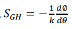Сначала идет расчес сдвига Гуса-Хенхена, используя метод стационарной фазы, по формуле 

где k — волновой вектор в вакууме, ∅ — угол падения, а θ — фазовый угол коэффициента отражения (𝑟̃). 

Общий вид коэффициента отражения можно записать

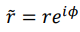

` `Таким образом, фазовый угол φ можно получить из выражения

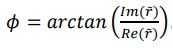 

На Рисунке 3а показаны рассчитанные сдвиги Гуса-Хенхена в зависимости от угла падения для длин волн 532 нм и 633 нм. Как и ожидалось, усиленный сдвиг Г-Х достигается при обобщенных углах Брюстера тонкопленочного оптического резонатора, и максимальный сдвиг Г-Х получается для p-поляризованного угла Брюстера при 76°. Примечательно, что рассчитанный максимальный сдвиг Г-Х при 70° и 76° превышает 85 и 110 раз рабочую длину волны, соответственно.

На Рисунках 3b и 3c показаны измеренные сдвиги Г-Х в зависимости от угла падения для длин волн 532 нм и 633 нм, соответственно. Мы регистрировали сдвиги Г-Х вблизи угла Брюстера (от 68° до 82°) и построили график среднего сдвига Г-Х, измеряя его в разных положениях образца. Мы отмечаем, что углы Брюстера тонкопленочного резонатора слегка смещены в сторону больших углов падения. Это связано с увеличением шероховатости поверхности слоя MMA при воздействии лазерного излучения (мощность = 5 мВт), однако этого можно избежать, используя SiO2 в качестве слоя резонатора (см. Рисунок S2 в Дополнительной информации). На обоих Рисунках 3(b) и 3(c) наблюдается резкое увеличение сдвига Г-Х при углах Брюстера для s- и p-поляризаций. Пиковые значения сдвига Г-Х, измеренные при угле Брюстера для 532 нм и 633 нм, составляют 41 мкм и 70 мкм, соответственно. Это показывает, что усиленный сдвиг Г-Х, измеренный при угле Брюстера, почти в 77 раз (для 532 нм) и 110 раз (632,8 нм) превышает длину волны возбуждения, и эти результаты хорошо согласуются с нашими расчетами. Примечательно, что полученные сдвиги Г-Х являются чрезвычайно высокими по сравнению с теми, что были зарегистрированы на аналогичных границах раздела, таких как ‘вблизи угла полного внутреннего отражения’, ‘вблизи угла Брюстера’ и ‘на краю фотонной запрещенной зоны’. Наблюдаемые изменения сдвигов Г-Х в окрестности угла Брюстера объясняются ограничениями измерения оптической установки. Небольшое увеличение или уменьшение отраженной интенсивности из-за изменения шероховатости поверхности слоя существенно влияет на фазовый сдвиг. Кроме того, фазовый сдвиг изменяется с небольшим смещением положения луча, особенно при больших углах падения, что, в свою очередь, влияет на абсолютную разницу между двумя средними значениями сдвигов Г-Х.

")

В заключение, экспериментально продемонстрироны усиленные и настраиваемые сдвиги Гуса-Хенхена (Г-Х) в видимом диапазоне длин волн, используя простой тонкопленочный поглощающий резонатор, состоящий из прозрачной диэлектрической пленки на поглощающей подложке. Усиленный сдвиг Г-Х достигается при углах Брюстера для s- и p-поляризованного света, которые составляют 77 и 110 раз от рабочей длины волны, соответственно. Разработанные интегрированные микронагреватели в тонкопленочных нанофотонных резонаторах без использования литографии могут применяться для создания экономичных перестраиваемых фотонных устройств, таких как оптические переключатели, делители луча и сенсоры.

Проведенное исследование наглядно демонстрирует, что данная область является не только динамично развивающейся, но и обладает значительным потенциалом для дальнейших научных и технологических прорывов.

Исследование отражательной и пропускательной способности диэлектрических пленок в условиях ПВО имеет множество практических применений, в том числе:  

• Сенсоры: Изменение показателя преломления среды над пленкой влияет на R и T, что позволяет использовать такие системы в качестве высокочувствительных сенсоров. 

` `• Оптические фильтры:  Подбором параметров пленки можно создать фильтры, пропускающие или отражающие свет в определенных спектральных диапазонах.  

• Оптические волноводы:  Тонкие пленки могут использоваться для создания оптических волноводов, в которых свет распространяется вдоль пленки.  

• Поляризационные элементы:  Выбор параметров пленки позволяет создавать устройства для управления поляризацией света.

# **Заключение**  
С помощью формулы (10) посчитали значения отражательной способности диэлектрических пленок при разных углах падения ТЕ- поляризованной плоской волны.  

Был построен график отражательной способности в зависимости от угла падения.

Наблюдался резкий скачек в области критического угла, объясняется это тем, что при угле падения, превышающим критический, происходит полное внутреннее отражение, при котором отражательная способность стремится к 1 (100%) для ТЕ- поляризованной плоской волны.

#

#

#

# **Список литературы**
1\. Твердохлеб, П. Е. Оптические свойства тонких диэлектрических плёнок / П. Е. Твердохлеб, М. А. Пономарёва. – Новосибирск : НГТУ, 2019. – 87 с.

2\. Матвеев, А. Н. Оптика / А. Н. Матвеев. – Москва : Высшая школа, 1985. – 351 с.

3\. Салех, Б. Оптика и фотоника: принципы и применение. В 2 т. Т. 1 / Б. Салех, М. Тейх. – Долгопрудный : Интеллект, 2012. – 760 с.

4\. Born, M., & Wolf, E. (1999). Principles of optics: electromagnetic theory of propagation, interference and diffraction of light. Cambridge university press. 

5\. Hecht, E. (2017). Optics. Pearson Education. 

6\. Yeh, P. (1988). Optical waves in layered media. Wiley

7\. Saleh, B. E. A., & Teich, M. C. (2019). Fundamentals of photonics. John Wiley & Sons. 

8\. MacLeod, H. A. (2010). Thin-film optical filters. CRC press. 

9\. Tsang, L., Kong, J. A., & Ding, K. H. (2000). Scattering of electromagnetic waves: numerical simulations. Wiley. 

10\. https://iopscience.iop.org/article/10.1088/0256-307X/21/3/019/meta

11\.https://dr.ntu.edu.sg/bitstream/10356/153514/2/Electrically%20tunable%20singular%20phase%20\_Manuscript%20file.pdf

12\. <https://iopscience.iop.org/article/10.1088/0256-307X/21/3/019/meta>

13\. Т. Тамир Волноводная электроника. 

14\. https://www.researchgate.net/profile/Maciej-Krawczyk-5/publication/269631352\_Goos-Hanchen\_effect\_and\_bending\_of\_spin\_wave\_beams\_in\_thin\_magnetic\_films/links/54915f490cf2d1800d87f6e1/Goos-Haenchen-effect-and-bending-of-spin-wave-beams-in-thin-magnetic-films.pdf
